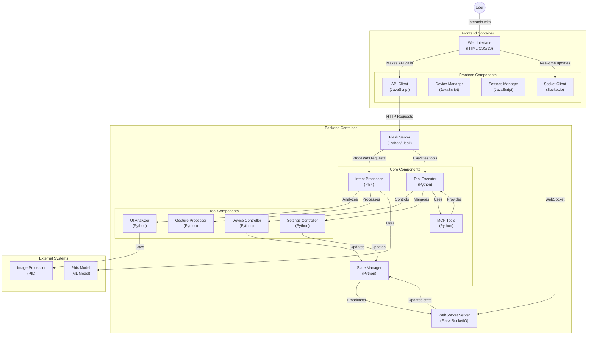

license_link: https://huggingface.co/microsoft/Phi-4-multimodal-instruct/resolve/main/LICENSE

The languages that each modal supports are the following:
- Text: Arabic, Chinese, Czech, Danish, Dutch, English, Finnish,
French, German, Hebrew, Hungarian, Italian, Japanese, Korean, Norwegian,
Polish, Portuguese, Russian, Spanish, Swedish, Thai, Turkish, Ukrainian
- Vision: English
- Audio: English, Chinese, German, French, Italian, Japanese, Spanish, Portuguese

📰 [Phi-4-multimodal Microsoft Blog](https://aka.ms/phi4-feb2025)  
📖 [Phi-4-multimodal Technical Report](https://aka.ms/phi-4-multimodal/techreport)  
🏡 [Phi Portal](https://aka.ms/phi-4-multimodal/azure)  
👩‍🍳 [Phi Cookbook](https://github.com/microsoft/PhiCookBook)  

🎉**Phi-4**: [[multimodal-instruct](https://huggingface.co/microsoft/Phi-4-multimodal-instruct) | [onnx](https://huggingface.co/microsoft/Phi-4-multimodal-instruct-onnx)]; 
[[mini-instruct](https://huggingface.co/microsoft/Phi-4-mini-instruct) | [onnx](https://huggingface.co/microsoft/Phi-4-mini-instruct-onnx)]

示例视频 "https://github.com/nguyenbh/phi4mm-demos/raw/refs/heads/main/clips/Phi-4-mini_Agents.mp4"

-phi4 模型本地部署路径
-pictures 用于测试的图片路径，包括收集的视频，游戏，地图页面，cut.py用于裁剪图片(模拟眼动数据)
-phi4_workflow 完整工作流的实现，主要为llm.py 工作流
-gesture 对phi4手势能力的测试
-dataset 收集的用于测试phi4/gemma3图像UI识别能力的数据集
-xeo-app 根据前端提供的图像搭建的一个简易前端

主要工作：
1.搭建完整工作流

Client部分
1.大模型部署部分
2.工具识别部分
3.连接服务器部分

Server部分
1.工具部分
2.工具执行部分

测试所用app架构
## Mermaid Diagram

## 项目分析文件

### 项目信息
- 工作空间根目录: `/home/lab/phi4`

### 核心文件分析

#### 1. xeo-app/backend/app.py
- 说明: 主应用程序入口点,定义了核心路由、WebSocket处理程序并集成所有组件。展示了整体系统结构和API端点。
- 文件大小: 16353 字节

#### 2. xeo-app/backend/mcp_tools.py  
- 说明: 定义了系统中可用的工具和操作,展示了核心功能和领域模型。
- 文件大小: 5128 字节

#### 3. xeo-app/backend/mcp_executor.py
- 说明: 实现了系统工具和操作的执行逻辑,揭示了命令如何处理以及状态如何管理。
- 文件大小: 12526 字节

#### 4. xeo-app/backend/phi_intent.py
- 说明: 使用Phi4模型处理自然语言处理和意图识别,展示了用户输入的解释方式。（主要）

#### 5. xeo-app/js/api.js
- 说明: 前端API集成代码,展示了客户端如何与后端服务交互。

#### 6. xeo-app/backend/.env
- 说明: 包含配置设置和环境变量,揭示了系统依赖和外部服务连接。

#### 7. xeo-app/index.html
- 说明: 主前端入口点,展示了整体UI结构和客户端架构。